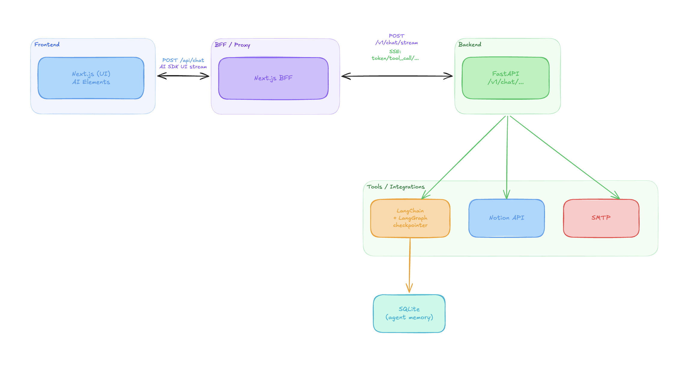

# Augmented baker

Assistant interne pour Madeleine Croûton, boulangère.
Un agent LLM branché sur le Notion de la boulangerie (stocks, ventes, fournisseurs)
et sur SMTP pour envoyer les commandes, avec validation humaine sur les actions à effet de bord.


## Démarrage

### Prérequis
- Python **3.13** (le projet pin `requires-python = ">=3.13"`) + [`uv`](https://docs.astral.sh/uv/)
- Node **20+** + `pnpm` (`corepack enable` suffit)
- Une clé Anthropic (`ANTHROPIC_API_KEY`)
- Un token Notion (`NOTION_TOKEN`) avec accès aux 4 bases (Stock Ingrédients, Catalogue Produits, Historique Ventes, Commandes Fournisseurs)
- Un SMTP joignable, Mailtrap pour le dev par defaut

### Setup Backend
#### Env var
```bash
cd backend
```
```.dotenv
APP_NAME=augmented-baker
ENV=dev
ANTHROPIC_API_KEY=...
NOTION_TOKEN=...
SMTP_HOST=sandbox.smtp.mailtrap.io
SMTP_PORT=2525
SMTP_USERNAME=...
SMTP_PASSWORD=...
SMTP_USE_TLS=true
SMTP_FROM='Madeleine Croûton <madeleine@chez-madeleine.test>'
```

### Frontend
Rien à faire, le docker compose s'en charge

### Lancer le projet
```bash
docker compose up
```

## Architecture

Pattern: Controller/Repository/Service, simple, pas de structure par domaine
FastAPI en back, Next js avec vercel AI SDK pour le front

 


## Choix techniques

### Langchain
Pourquoi pas Langgraph ou même deep agents ? car overkill pour le use case
Langchain 1.X introduit le middleware, ca nous permet d'avoir le controle dont on a besoin + le create_agent qui permet
de boucler naturellement entre tool call et génération de réponse
Pourquoi pas une autre lib ? Je suis à l'aise sur celle la, tout simplement. Et ici les abstractions proposer par langchain
ont du sens car elle permette d'aller vite sans réinventer la roue

#### Checkpointer
SQlite en checkpointer est natif à langchain, toutes les conversations sont sauvegardées et persistées entre les reboots.
Ca prend nativement en charge beaucoup de feature, mais celle qui nous intéresse ici c'est le Human In The Loop (HITL)
pour approuver les tools calls de Madeleine
C'est pratique mais personnellement je n'aime pas le format car impossible de lire l'historique de conversations nativement
en SQL, on est obligé de passer par un script

### Claude Sonnet
Meilleur modèle actuellement pour des Agents IA sur les différents projet ou j'ai pu le tester. Le suivi des instructions
est aujourd'hui au dessus de la concurrence (mais ca change vite)
Pourquoi pas Opus ou Haiku: Haiku les tools call c'est pas trop ca, Opus overkill pour ce use case, on a pas besoin de tant
de reflexion que ca
Si on était dans un cas de prod, j'aurais ajouter un modèle en fallback, type gpt-5, au cas ou anthropic est indispo ou si
on se fait rate limit
Pourquoi pas un modèle open source en local ? Ma machine ne fait pas tourner un modèle assez puissant pour assurer que les tools
call se font bien. Et puis trop avancé pour ce simple use case

### FastAPI
Simple et rapide de mettre en place des APIs avec. Le couple Langchain + FastAPI fonctionne bien.
Et puis FastAPI vient de sortir récemment le SSE natif. C'est top pour streamer les réponses LLM

### Next.js + Vercel AI SDK + AI Elements
Next js est overkill pour ce use cas, j'en ai conscience, mais avec le SDK vercel + leur composant IA déjà tout fait, ca
ne prend pas de temps de sortir une interface de chat simple et il n'y a rien à maintenir car c'est leur propre lib/composants


## Idéation

- Affichage tool calls complet
- Logs les discussions pour faire du debug
- Tool calls secure
- Madeleine n'est pas tech, on va pas lui mettre une interface dans le terminal. un petit front avec le Vercel AI sdk c'est pas mal
- Matcher la manière de parler de Madeleine avec un vocabulaire imagé
- Elle veut un assistant interne qui l'aide à gérer son business
- Langchain DeepAgents ? Langchain simple ? Langgraph overkill ?
- Rester pragmatique, le multi agents, usecase trop simple pour s'en servir
- Attention au fait de donner à l'agent de quoi executer des requêtes en DB
- confirmation l'envoie de mail
- Pour l'envoi de mails, mettre Madeleine en copie
- Tool libre idées:
    - A chaque début de conv, lancer un agents qui check les stocks
    - Ecriture dans la mémoire persistante -> simple, fichier Markdown par exemple
- Description de la mission mentionne FastAPI, let's go sur ca
- logging local langsmith-like ? file system
- Utilisation de la nouvelle primitive SSE de fastAPI (release y a ~1,5 mois )
- injection details system prompt (jour, heure, mini calendrier à venir pour palier l'arithmetique bug sur les dates)
- pas de séparation des directory par domain car petite app
- on pourrait envoyer des alertes dans le context quand on s'approche de période importante (buches de noel, galettes des rois, paques, ...)
- fetch important infos et les mettres dans le context à chaque tour
  - pro-activité de l'agent: chaque démarrage de conv=context eng avec stock à sec ou bientot à sec -> ajout context -> Agent en capacité d'alerter avant qu'on pose la question

Pour un poste Senior, les questions que j'aurais posés sont :
- Utiliser le JS vs le python (vercel AI SDK vs une API python)
- API model provider vs utiliser un model open source
- Gros model vs petit model
- comment fonctionne le caching des tokens ?
- RAG vs Query vs injection
